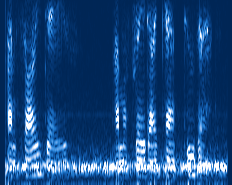
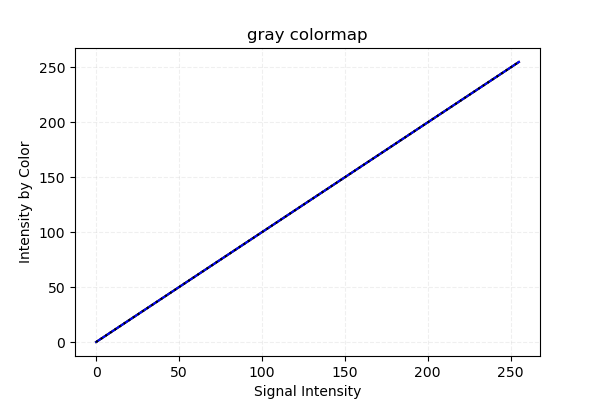
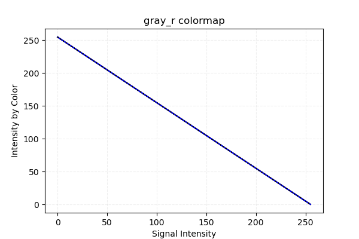
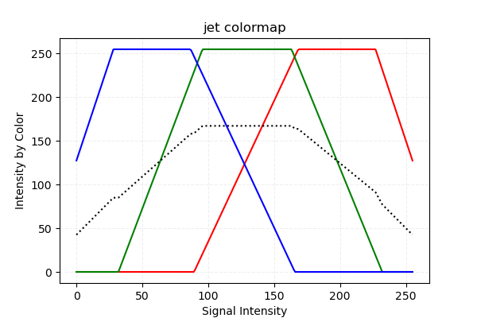

# Spectrogram
**Spectrogram** is a .NET library for creating spectrograms from pre-recorded signals or live audio from the sound card.  Spectrogram uses FFT algorithms and window functions provided by the [FftSharp](https://github.com/swharden/FftSharp) project, and it targets .NET Standard 2.0 so it can be used in .NET Framework and .NET Core projects.

<div align="center">


_"I'm sorry Dave... I'm afraid I can't do that"_

</div>


## Quickstart

_Spectrogram is [available on NuGet](https://www.nuget.org/packages/Spectrogram)_

```cs
double[] audio = Read.WavInt16mono("hal.wav");
int sampleRate = 44100;

var spec = new Spectrogram(sampleRate, fftSize: 4096, stepSize: 500, maxFreq: 3000);
spec.Add(audio);
spec.SaveImage("hal.png", intensity: .4);
```

This code generates the image displayed at the top of this page.

## Windows Forms

If you're using Spectrogram in a graphical application you may find it helpful to retrieve the output as a Bitmap which can be displayed on a Picturebox:

```cs
Bitmap bmp = spec.GetBitmap();
pictureBox1.Image = bmp;
```

I find it helpful to put the Picturebox inside a Panel with auto-scroll enabled, so large spectrograms which are bigger than the size of the window can be interactively displayed.

## Song-to-Spectrogram

This example demonstrates how to convert a MP3 file to a spectrogram image. A sample MP3 audio file in the [data folder](data) contains the audio track from Ken Barker's excellent piano performance of George Frideric Handel's Suite No. 5 in E major for harpsichord ([_The Harmonious Blacksmith_](https://en.wikipedia.org/wiki/The_Harmonious_Blacksmith)). This audio file is included [with permission](dev/Handel%20-%20Air%20and%20Variations.txt), and the [original video can be viewed on YouTube](https://www.youtube.com/watch?v=Mza-xqk770k).

```cs
double[] audio = Read.WavInt16mono("Handel.wav");
int sampleRate = 44100;

var spec = new Spectrogram(sampleRate, fftSize: 16384, stepSize: 2500, maxFreq: 2200);
spec.Add(audio);
spec.SaveImage("spectrogram-song.jpg", intensity: 5, dB: true);
```

Notice the optional conversion to Decibels while saving the image.


If you [listen to the audio track](https://www.youtube.com/watch?v=Mza-xqk770k) while closely inspecting the spectrogram you can identify individual piano notes and chords, and may be surprised by the interesting patterns that emerge around trills and glissandos.

## Spectrogram Information

The Spectrogram's `ToString()` method displays detailed information about the spectrogram:

```cs
Console.WriteLine(spec);
```
```
Spectrogram (2993, 817)
  Vertical (817 px): 0 - 2,199 Hz, FFT size: 16,384 samples, 2.69 Hz/px
  Horizontal (2993 px): 2.96 min, window: 0.37 sec, step: 0.06 sec, overlap: 84%
```

## Colormaps

These examples demonstrate the identical spectrogram analyzed with a variety of different colormaps. Spectrogram colormaps can be changed by calling the `SetColormap()` method:

```cs
double[] audio = Read.WavInt16mono("hal.wav");
int sampleRate = 44100;
int fftSize = 8192;
var spec = new Spectrogram(sampleRate, fftSize, stepSize: 200, maxFreq: 3000);
spec.Add(audio);
spec.SetColormap(Colormap.Jet);
spec.SaveImage($"hal-Jet.png", intensity: .5);
```

Colormap Name | Color Curves | Example Spectrogram
---|---|---
Argo |  | 
Blues |  | 
Cividis |  | 
Grayscale |  | 
GrayscaleReversed |  | 
Greens |  | 
Inferno |  | 
Jet |  | 
Magma |  | 
Plasma |  | 
Viridis |  | 

## Resources
* [FftSharp](https://github.com/swharden/FftSharp) - the module which actually performs the FFT and related transformations
* [MP3Sharp](https://github.com/ZaneDubya/MP3Sharp) - a library I use to read MP3 files during testing
* [FSKview](https://github.com/swharden/FSKview) - a real-time spectrogram for viewing frequency-shift-keyed (FSK) signals from audio transmitted over radio frequency.