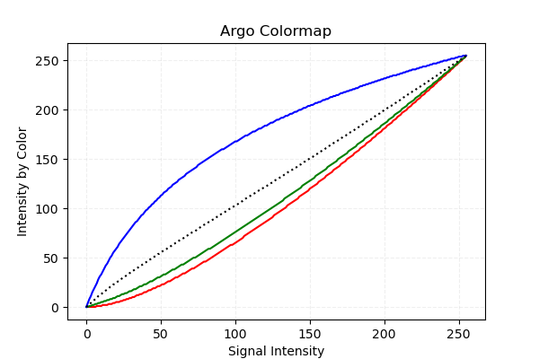
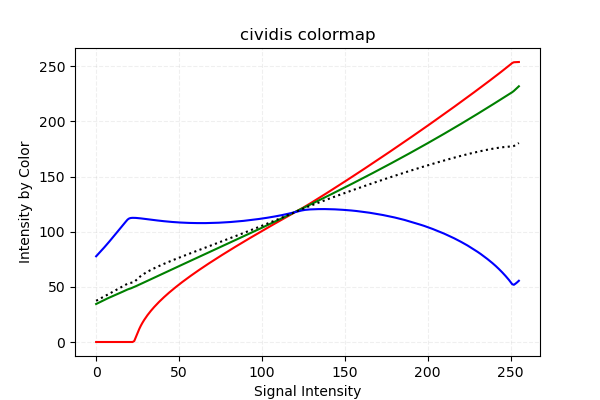
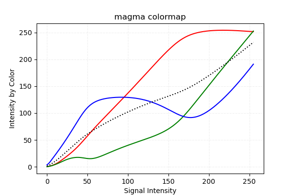
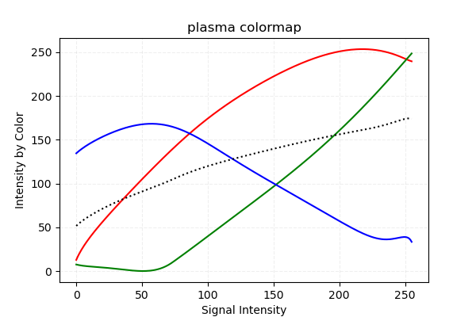
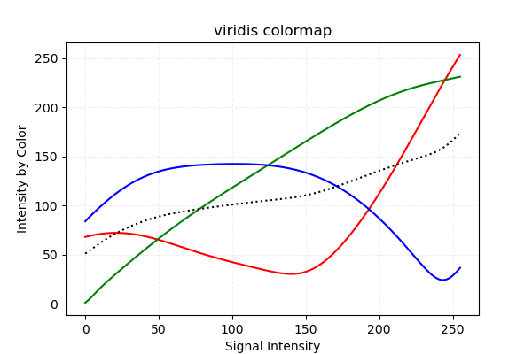

# Spectrogram
**Spectrogram** is a .NET library for creating spectrograms from pre-recorded signals or live audio from the sound card.  Spectrogram uses FFT algorithms and window functions provided by the [FftSharp](https://github.com/swharden/FftSharp) project, and it targets .NET Standard 2.0 so it can be used in .NET Framework and .NET Core projects.

<div align="center">


_"I'm sorry Dave... I'm afraid I can't do that"_

</div>


## Quickstart

### Install

Spectrogram can be installed with NuGet:\
https://www.nuget.org/packages/Spectrogram

### Create a Spectrogram

This code in [Program.cs](src/Spectrogram.Quickstart/Program.cs) was used to create the above image:
```cs
(double[] audio, int sampleRate) = Read.MP3("cant-do-that.mp3");

var spec = new Spectrogram(
        signal: audio,
        sampleRate: sampleRate,
        fftSize: 4096,
        stepSize: 500,
        freqMax: 2500,
    );

spec.SaveJPG("output.jpg");
```

If you're using Spectrogram in a graphical application you may find it helpful to retrieve the output as a Bitmap suitable for applying to a Picturebox or similar control:

```cs
Bitmap bmp = spec.GetBitmap();
pictureBox1.Image = bmp;
```

After calculating the Spectrogram (the slow step) FFT magnitudes are stored in memory so you can rapidly recalculate pixel intensities based on new parameters:

```cs
spec.Recalculate(
        multiplier: 2.8,
        dB: true,
        cmap: new Inferno()
    );
spec.SaveJPG("output2.jpg");
```

## Song-to-Spectrogram

This example demonstrates how to convert a MP3 file to a spectrogram image. A sample MP3 audio file in the [data folder](data) contains the audio track from Ken Barker's excellent piano performance of George Frideric Handel's Suite No. 5 in E major for harpsichord ([_The Harmonious Blacksmith_](https://en.wikipedia.org/wiki/The_Harmonious_Blacksmith)). This audio file is included [with permission](dev/Handel%20-%20Air%20and%20Variations.txt), and the [original video can be viewed on YouTube](https://www.youtube.com/watch?v=Mza-xqk770k).


If you [listen to the audio track](https://www.youtube.com/watch?v=Mza-xqk770k) while closely inspecting the spectrogram you can identify individual piano notes and chords, and may be surprised by the interesting patterns that emerge around trills and glissandos.

```cs
// TODO: update this example
```

## Colormaps

These examples demonstrate the identical spectrogram analyzed with a variety of different colormaps.

Colormap Name | Color Curves | Example Spectrogram
---|---|---
Argo |  | 
Blues |  | 
Cividis |  | 
Grayscale |  | 
Greens |  | 
Inferno |  | 
Jet |  | 
Magma |  | 
Plasma |  | 
Viridis |  | 

## Resources

### Similar Software
* Argo ([website](http://digilander.libero.it/i2phd/argo/)) - closed-source QRSS viewer for Windows
* SpectrumLab ([website](http://www.qsl.net/dl4yhf/spectra1.html)) - closed-source spectrum analyzer for Windows 
* QrssPIG ([GitLab](https://gitlab.com/hb9fxx/qrsspig)) - open-source spectrograph for Raspberry Pi (C++)
* Lopora ([GitHub](https://github.com/swharden/Lopora)) - open-source spectrograph (Python 3) 
* QRSS VD ([GitHub](https://github.com/swharden/QRSS-VD)) - open source spectrograph (Python 2)