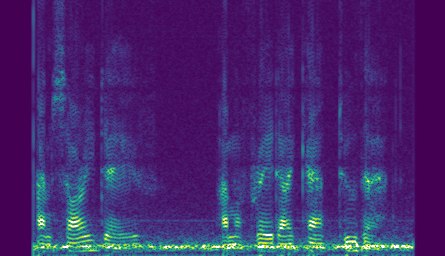
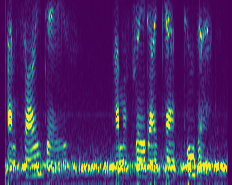
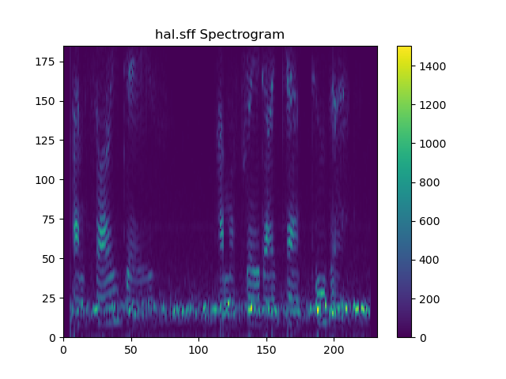

# Spectrogram
**Spectrogram** is a .NET library for creating spectrograms from pre-recorded signals or live audio from the sound card.  Spectrogram uses FFT algorithms and window functions provided by the [FftSharp](https://github.com/swharden/FftSharp) project, and it targets .NET Standard 2.0 so it can be used in .NET Framework and .NET Core projects.

<div align="center">



_"I'm sorry Dave... I'm afraid I can't do that"_

</div>


## Quickstart

_Spectrogram is [available on NuGet](https://www.nuget.org/packages/Spectrogram)_

```cs
double[] audio = Read.WavInt16mono("hal.wav");
int sampleRate = 44100;

var spec = new Spectrogram(sampleRate, fftSize: 4096, stepSize: 500, maxFreq: 3000);
spec.Add(audio);
spec.SaveImage("hal.png", intensity: .4);
```

This code generates the image displayed at the top of this page.

## Windows Forms

If you're using Spectrogram in a graphical application you may find it helpful to retrieve the output as a Bitmap which can be displayed on a Picturebox:

```cs
Bitmap bmp = spec.GetBitmap();
pictureBox1.Image = bmp;
```

I find it helpful to put the Picturebox inside a Panel with auto-scroll enabled, so large spectrograms which are bigger than the size of the window can be interactively displayed.

## Real-Time Spectrogram

An example program is included in this repository which demonstrates how to use [NAudio](https://github.com/naudio/NAudio) to get samples from the sound card and display them as a spectrogram. Spectrogram was designed to be able to display spectrograms with live or growing data, so this is exceptionally easy to implement.


To do this, keep your Spectrogram at the class level:
```cs
Spectrogram spec;

public Form1()
{
    InitializeComponent();
    spec = new Spectrogram(sampleRate, fftSize: 4096, stepSize: 500, maxFreq: 3000);
}
```

Whenever an audio buffer gets filled, add the data to your Spectrogram:
```cs
private void GotNewBuffer(double[] audio)
{
    spec.Add(audio);
}
```

Then set up a timer to trigger rendering:
```cs
private void timer1_Tick(object sender, EventArgs e){
    Bitmap bmp = spec.GetBitmap(intensity: .4);
    pictureBox1.Image?.Dispose();
    pictureBox1.Image = bmp;
}
```

Review the source code of the demo application for additional details and considerations. You'll found I abstracted the audio interfacing code into its own class, isolating it from the GUI code.

## Song-to-Spectrogram

This example demonstrates how to convert a MP3 file to a spectrogram image. A sample MP3 audio file in the [data folder](data) contains the audio track from Ken Barker's excellent piano performance of George Frideric Handel's Suite No. 5 in E major for harpsichord ([_The Harmonious Blacksmith_](https://en.wikipedia.org/wiki/The_Harmonious_Blacksmith)). This audio file is included [with permission](dev/Handel%20-%20Air%20and%20Variations.txt), and the [original video can be viewed on YouTube](https://www.youtube.com/watch?v=Mza-xqk770k).

```cs
double[] audio = Read.WavInt16mono("Handel.wav");
int sampleRate = 44100;

var spec = new Spectrogram(sampleRate, fftSize: 16384, stepSize: 2500, maxFreq: 2200);
spec.Add(audio);
spec.SaveImage("spectrogram-song.jpg", intensity: 5, dB: true);
```

Notice the optional conversion to Decibels while saving the image.


If you [listen to the audio track](https://www.youtube.com/watch?v=Mza-xqk770k) while closely inspecting the spectrogram you can identify individual piano notes and chords, and may be surprised by the interesting patterns that emerge around trills and glissandos.

## Spectrogram Information

The Spectrogram's `ToString()` method displays detailed information about the spectrogram:

```cs
Console.WriteLine(spec);
```

```
Spectrogram (2993, 817)
  Vertical (817 px): 0 - 2,199 Hz, FFT size: 16,384 samples, 2.69 Hz/px
  Horizontal (2993 px): 2.96 min, window: 0.37 sec, step: 0.06 sec, overlap: 84%
```

## Colormaps

These examples demonstrate the identical spectrogram analyzed with a variety of different colormaps. Spectrogram colormaps can be changed by calling the `SetColormap()` method:

```cs
double[] audio = Read.WavInt16mono("hal.wav");
int sampleRate = 44100;
int fftSize = 8192;
var spec = new Spectrogram(sampleRate, fftSize, stepSize: 200, maxFreq: 3000);
spec.Add(audio);
spec.SetColormap(Colormap.Jet);
spec.SaveImage($"hal-Jet.png", intensity: .5);
```

Viridis | Jet | GrayReversed | GreensReversed
---|---|---|---
|||

See all colormaps in [dev/colormap/](dev/colormap/)

## Spectrogram File Format (SFF)

The Spectrogram library has methods which can read and write SFF files, a file format specifically designed for storing spectrogram data. SFF files contain 2D spectrogram data (repeated FFTs) with a [small header](dev/sff) describing the audio and FFT settings suitable for deriving scale information. 

SFF files store `double` values (8-byte floating-point data) which is far superior to saving spectrograms as indexed color images (which represent intensity with a single `byte` per pixel).

SFF files be saved using `Complex` data format (with real and imaginary values for each point) to faithfully represent the FFT output, or `double` format to represent magnitude (with an optional pre-conversion to Decibels to represent power). 

```cs
double[] audio = Read.WavInt16mono("hal.wav");
int sampleRate = 44100;
int fftSize = 1 << 12;
var spec = new Spectrogram(sampleRate, fftSize, stepSize: 700, maxFreq: 2000);
spec.Add(audio);
spec.SaveData("hal.sff");
```

The `hal.sff` file can now be read in any language. A Python module to read SFF files has been created (in [dev/sff](dev/sff)) which allows Spectrograms created by this library and stored in SFF format to be loaded as 2D numpy arrays in Python.

```python
import matplotlib.pyplot as plt
import sffLib

# load spectrogram data as a 2D numpy array
sf = sffLib.SpectrogramFile("hal.sff")

# plot the spectrogram as a heatmap
freqs = np.arange(sf.values.shape[1]) * sf.hzPerPx / 1000
times = np.arange(sf.values.shape[0]) * sf.secPerPx
plt.pcolormesh(freqs, times, sf.values)

# decorate the plot
plt.colorbar()
plt.title("Spectrogram Magnitude (RMS)")
plt.ylabel("Time (seconds)")
plt.xlabel("Frequency (kHz)")
plt.show()
```



## Resources
* [FftSharp](https://github.com/swharden/FftSharp) - the module which actually performs the FFT and related transformations
* [MP3Sharp](https://github.com/ZaneDubya/MP3Sharp) - a library I use to read MP3 files during testing
* [FSKview](https://github.com/swharden/FSKview) - a real-time spectrogram for viewing frequency-shift-keyed (FSK) signals from audio transmitted over radio frequency.
* [NAudio](https://github.com/naudio/NAudio) - an open source .NET library which makes it easy to get samples from the microphone or sound card in real time